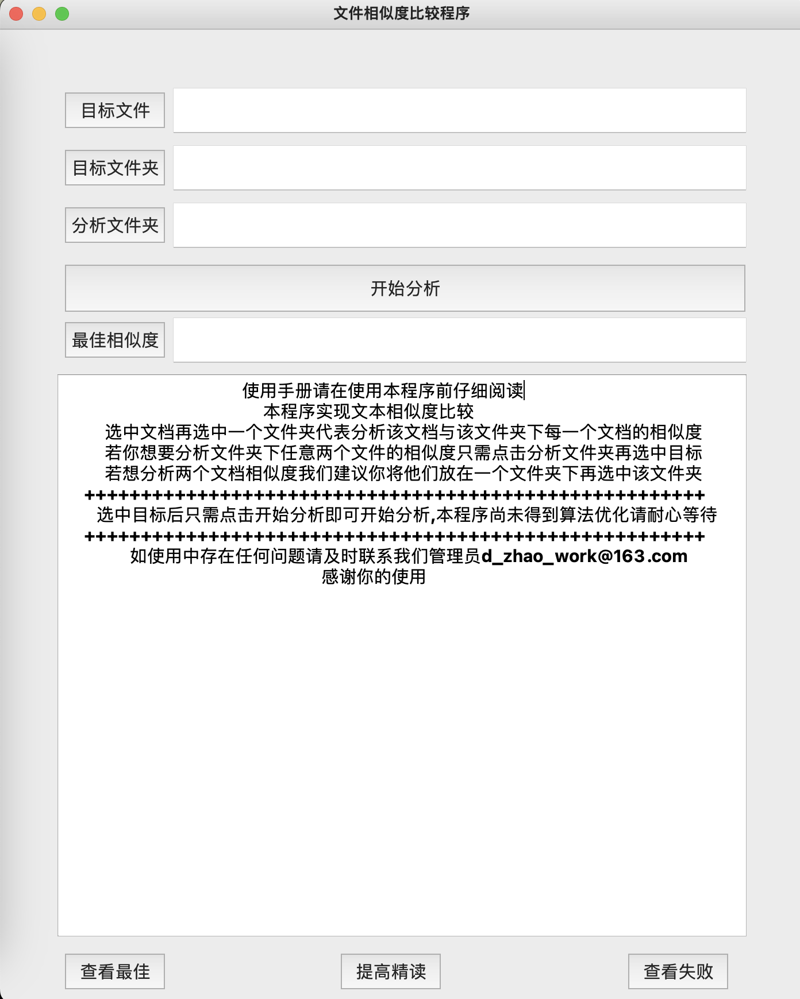
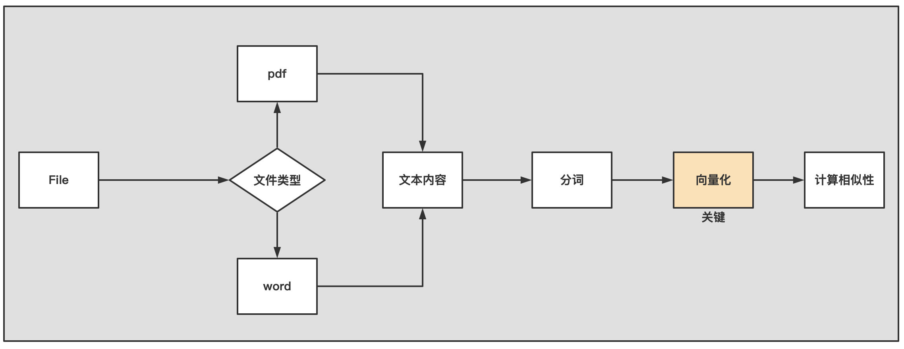

# TextSimilarity—文本相似度对比【附带图形化界面】

### 1、实现的主要功能

- 计算一个指定的文件和一个指定的文件夹下面每一个文件的相似度

- 计算一个文件下任意两个文件的相似度

  

  
## 2、实现原理

本文的实现原来比较简单，总体上，就是先通过python的工具将文本从文件中提取出来，然后对其进行分词，这一步之后每一个文件都有一个词语列表与之对应，接下来就是词的向量化，向量化的技术非常多，本文基于原生的tf-idf算法。


## 3、项目地址

- github地址:https://github.com/HumbleSwage/TextSimilarity

- csdn地址:

- 百度网盘:

- 测试数据：链接: https://pan.baidu.com/s/1rS8BvDVadu2Xf3C6UbwQJA 提取码: h9ke

  

## 3、项目部署

本项目推荐的部署方式是通过github，如果你没有这方面的经验，可以先去网上学习一下，或者直接通过百度网盘下载完整的源代码。

- 将项目拉取到本地

  - 创建工作目录

    ```bash
    mkdir TextSimilarityProject
    cd TextSimilarityProject
    ```

  - 克隆

    ```bash
    git clone git@github.com:HumbleSwage/TextSimilarity.git
    ```

- 配置环境

  - 使用conda创建环境

    ```bash
    conda create -n TextSimilarity python=3.8
    ```

  - 激活环境

    ```bash
    conda activate TextSimilarity
    ```

  - 下载依赖

    ```bash
    pip install -r requirements.txt
    ```

- 运行程序

  ```bash
  go run main.go
  ```

如果你尝试了所有的方法都不能成功运行，但是你又想尝试一哈本本项目的一个具体效果，那么可以直接下载一个exe文件在本地运行，另外可以联系d_zhao_work@163.com帮你解决。

## 4、未来拓展

- 针对向量化技术

  本文的向量化技术使用的是原生的tf-idf，其实sklearn已经提供了这样直接计算tf-idf的接口，非常的方便。另外词的向量化技术也可以选择一些其他的技术，比如说`word2vec`等等，下面是一些推荐的链接，你可以作为拓展方向：

  - [深入浅出Word2Vec原理解析](https://zhuanlan.zhihu.com/p/114538417)
  - [词向量经典模型](https://zhuanlan.zhihu.com/p/51682879)
  - [sklearn处理文本数据](https://www.sklearncn.cn/59/)

- 针对功能

  其实本项目的扩展方向比较宽，如果你的时间足够可以尝试以下的方向

  - 提取文本中的图片进行对比；
  - 提取文本中的表格与标准表格进行对比，判断正确个数；
  - 将本项目演变为一个自动打分系统；

- 使用pyinstaller将本项目打包为exe或者.app可执行文件

  我们已经将项目进行打包，你可以直接进行体验

  - exe下载地址：
  - dmg下载地址：链接: https://pan.baidu.com/s/1JOrqoe8WXi7xkB0zxFPxmw 提取码: 7ux7

  ```bash
  pyinstaller -F -w -i Pic/logo.ico main.py 
  -p ./Core --hidden-import CalculateSimilarity.py 
  -p ./Core --hidden-import Quantification.py 
  -p ./Panel --hidden-import MyMainForm.py
  -p ./Panel --hidden-import Ui.py
  -p ./Processor --hidden-import CutSelectContent.py
  -p ./Reader --hidden-import ReadContentAndPath.py
  -p ./Reader --hidden-import ReadFileContent.py
  -p ./Utils --hidden-import BeautifulOut.py
  ```
